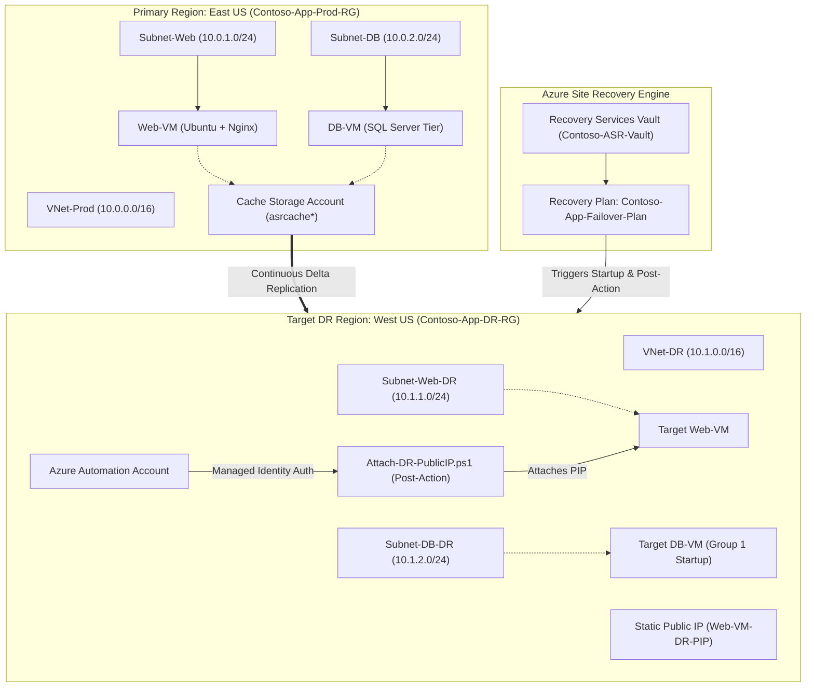

# ☁️ Azure Site Recovery (ASR) Failover Plan for Business Applications

[](https://learn.microsoft.com/en-us/credentials/certifications/azure-administrator/)
[](#1-architecture-overview)
[](#3-quick-deployment-guide)
[](#-business-value--rto--rpo-metrics)

An enterprise-grade **Azure-to-Azure Site Recovery (ASR)** Disaster Recovery solution designed for the **AZ-104 Azure Administrator Hackathon**. This project demonstrates automated cross-region replication, sequenced Recovery Plan startup (Database → Web), and dynamic Public IP cutover using Azure Automation Account System-Assigned Managed Identity.

---

## 📐 Architecture Overview



---

## 📂 Repository Layout

```text
├── README.md                        # Master Repository Documentation & Setup Guide
├── HACKATHON_RUNBOOK.md             # Detailed Step-by-Step Execution Guide & Pre-flight Checklist
├── PRESENTATION_PITCH_DECK.md       # 5-Minute Timed Pitch Script & Judge Q&A Guide
├── index.html                      # Interactive Visual Dashboard & Real-Time Failover Simulator
└── scripts/
    ├── 1-deploy-base-infra.sh       # Bash Script: Deploys East US Primary Infrastructure
    ├── 1-deploy-base-infra.azcli    # Raw Azure CLI snippet for Primary Region
    ├── 2-deploy-dr-infra.sh         # Bash Script: Deploys West US DR Infrastructure & Vault
    ├── 2-deploy-dr-infra.azcli      # Raw Azure CLI snippet for DR Region
    ├── cloud-init-primary.txt       # Cloud-init configuration for Primary Nginx Web Server
    ├── Attach-DR-PublicIP.ps1       # PowerShell Runbook for Dynamic Network Cutover
    ├── 3-enable-replication-helper.sh # Replication configuration & verification helper
    └── cleanup-resources.sh         # One-click Azure resource teardown script
```

---

## 📊 Environment & Configuration Blueprint

| Category | Primary Region (`East US`) | Disaster Recovery Region (`West US`) |
| :--- | :--- | :--- |
| **Resource Group** | `Contoso-App-Prod-RG` | `Contoso-App-DR-RG` |
| **Virtual Network** | `VNet-Prod` (`10.0.0.0/16`) | `VNet-DR` (`10.1.0.0/16`) |
| **Subnets** | `Subnet-Web` (`10.0.1.0/24`)<br>`Subnet-DB` (`10.0.2.0/24`) | `Subnet-Web-DR` (`10.1.1.0/24`)<br>`Subnet-DB-DR` (`10.1.2.0/24`) |
| **Compute - Web** | `Web-VM` (Ubuntu 22.04 LTS, Standard_B2s) | Target VM (Spun up on failover) |
| **Compute - DB** | `DB-VM` (Ubuntu 22.04 LTS, Standard_B2s) | Target VM (Group 1 Startup) |
| **Replication Vault** | Cache Storage: `asrcache*` (East US) | Recovery Services Vault: `Contoso-ASR-Vault` |
| **Network Cutover** | Dynamic Public IP | Pre-created Static Public IP (`Web-VM-DR-PIP`) |
| **Automation** | N/A | Automation Account: `Contoso-ASR-AutoAccount` |

---

## ⚡ Quick Deployment Guide

### Prerequisites
* Active Azure Subscription (AZ-104 Sandbox / Trial / Pass).
* Azure CLI installed or access to **Azure Cloud Shell** (`bash`).
* Contributor or Owner permissions on the subscription.

---

### Step 1: Deploy Primary Infrastructure (`East US`)
Run the deployment script to spin up the Primary Resource Group, VNet, Subnets, NSG rules, and VMs:
```bash
chmod +x scripts/*.sh
./scripts/1-deploy-base-infra.sh
```

### Step 2: Deploy DR Infrastructure (`West US`)
Run the secondary script to provision the target DR VNet, Recovery Services Vault, Cache Storage Account, and Automation Account with Managed Identity:
```bash
./scripts/2-deploy-dr-infra.sh
```

### Step 3: Enable Site Recovery Replication
1. Open **Azure Portal** > **Recovery Services Vault** (`Contoso-ASR-Vault`).
2. Go to **Site Recovery infrastructure** > **Network Mapping** > Map `VNet-Prod` to `VNet-DR`.
3. Go to **Resource Groups** > `Contoso-App-Prod-RG` > `Web-VM` > **Disaster Recovery**.
4. Set Target Region to **West US**, Target VNet to **VNet-DR**, Subnet to **Subnet-Web-DR**, and Cache Storage Account to `asrcache*`.
5. Click **Review + Start replication**. Repeat for `DB-VM` (Subnet: `Subnet-DB-DR`).

### Step 4: Import PowerShell Automation Runbook
1. Navigate to **Automation Account** (`Contoso-ASR-AutoAccount`) > **Runbooks**.
2. Create a **PowerShell 7.2** Runbook named `Attach-DR-PublicIP`.
3. Paste code from [`scripts/Attach-DR-PublicIP.ps1`](file:///Users/vishnuganugula/KLU/3.1/Azure/scripts/Attach-DR-PublicIP.ps1) and click **Publish**.
4. Ensure System-Assigned Managed Identity is enabled and assigned the **Network Contributor** role on `Contoso-App-DR-RG`.

### Step 5: Build Sequenced Recovery Plan & Run Test Failover
1. In `Contoso-ASR-Vault`, create **Recovery Plan**: `Contoso-App-Failover-Plan`.
2. Move `DB-VM` to **Group 1** (Database starts first).
3. Move `Web-VM` to **Group 2** (Web Server starts after DB is healthy).
4. Right-click **Group 2** > **Add post-action** > Script -> Select `Attach-DR-PublicIP`.
5. Click **Test Failover** to initiate zero-impact verification!

---

## 🤖 PowerShell Runbook Cutover Logic

The runbook [`scripts/Attach-DR-PublicIP.ps1`](file:///Users/vishnuganugula/KLU/3.1/Azure/scripts/Attach-DR-PublicIP.ps1) automates network cutover during failover without stored credentials:

```powershell
Param([object]$RecoveryPlanContext)
$ErrorActionPreference = "Stop"

# Authenticate via System-Assigned Managed Identity
Connect-AzAccount -Identity

$TargetResourceGroup = "Contoso-App-DR-RG"
$TargetVmName        = "Web-VM" 
$DrPublicIpName      = "Web-VM-DR-PIP" 

# Fetch target VM & primary NIC
$VM = Get-AzVM -ResourceGroupName $TargetResourceGroup -Name $TargetVmName
$NicId = $VM.NetworkProfile.NetworkInterfaces[0].Id
$NicName = ($NicId -split '/')[-1] 
$NIC = Get-AzNetworkInterface -ResourceGroupName $TargetResourceGroup -Name $NicName

# Attach pre-created static Public IP
$PublicIP = Get-AzPublicIpAddress -ResourceGroupName $TargetResourceGroup -Name $DrPublicIpName
$NIC.IpConfigurations[0].PublicIpAddress = $PublicIP
Set-AzNetworkInterface -NetworkInterface $NIC
```

---

## 📈 Business Value & RTO / RPO Metrics

* **Recovery Time Objective (RTO):** **4 min 30 sec** *(Industry standard < 15 mins)*
* **Recovery Point Objective (RPO):** **< 30 sec** *(Continuous delta disk sync)*
* **Cost Efficiency:** **\$0 compute cost in DR region** during idle standby (paying only for managed disk storage).
* **Security:** 100% passwordless automation using Azure Managed Identities & RBAC.

---

## 💻 Interactive Visual Dashboard & Pitch Deck

This repository includes a standalone interactive web application: [`index.html`](file:///Users/vishnuganugula/KLU/3.1/Azure/index.html).

Open [`index.html`](file:///Users/vishnuganugula/KLU/3.1/Azure/index.html) in your browser to access:
- 🗺️ **Interactive Architecture Topology Visualizer**
- ⚡ **Real-Time Test Failover Log Simulator**
- 🎤 **5-Minute Timed Pitch Deck Viewer**
- ❓ **Judge Q&A Cheat Sheet**

---

## 🧹 Cleanup Resources

To avoid incurring charges after your hackathon presentation, run:
```bash
./scripts/cleanup-resources.sh
```

---

## 📜 License & Credits

Built for the **AZ-104 Azure Administrator Certificate Hackathon**.  
Designed with Microsoft Azure best practices for Business Continuity & Disaster Recovery (BCDR).
