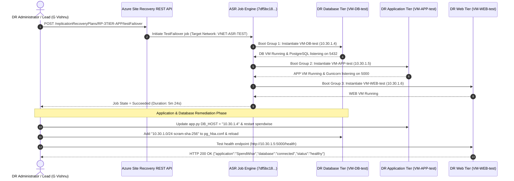

# 🛡️ Disaster Recovery Failover Plan & Operational Runbook

## 1. Document Control & Scope

* **Application Name:** SpendWise 3-Tier Enterprise Application
* **Primary Region:** Central India (`centralindia`)
* **Disaster Recovery Region:** India South Central (`indiasouthcentral`)
* **Orchestration Tool:** Azure Site Recovery (ASR) + ARM REST API
* **Target RTO:** `< 10 Minutes` (Empirically Achieved: `5 Minutes 24 Seconds`)
* **Target RPO:** `< 30 Seconds` (Continuous A2A block-level replication)
* **Resource Group:** `RG-ASR-24CC3046` (DR: `RG-ASR-24CC3046-DR`)
* **Recovery Services Vault:** `RSV-ASR-24CC3046`
* **Recovery Plan:** `RP-3TIER-APP`

---

## 2. Emergency Trigger Criteria & Activation

A disaster state is declared and failover is initiated under the following conditions:
1. **Full Regional Outage:** Microsoft Azure reports an unrecoverable outage affecting compute or storage services in Central India.
2. **Primary Site Incident:** Complete network partition or storage corruption affecting `RG-ASR-24CC3046`.
3. **Severe SLA Violation:** Production SpendWise health endpoint returning HTTP 5xx or unreachable for > 15 consecutive minutes.

---

## 3. Pre-Failover Verification Checklist

Before initiating failover:
- [x] Confirm `RSV-ASR-24CC3046` shows **Protected** replication state with **Normal** health for `VM-DB`, `VM-APP`, and `VM-WEB`.
- [x] Confirm `VNET-ASR-TEST` (`10.30.1.0/24`) has available IP capacity on `SUBNET-TEST`.
- [x] Verify Linux kernel `5.15.0-1003-azure` is running on target VMs.
- [x] Verify Recovery Plan `RP-3TIER-APP` contains 3 distinct Boot Groups (Group 1: DB, Group 2: APP, Group 3: WEB).

---

## 4. Failover Execution Workflow



---

## 5. Step-by-Step Execution Procedure

### Step 5.1: Execute Test Failover (REST API Method)
When using Azure CLI without the `cleanup-test-failover` subcommand, execute direct REST API call:
```bash
az rest --method post \
  --url "https://management.azure.com/subscriptions/.../resourceGroups/RG-ASR-24CC3046/providers/Microsoft.RecoveryServices/vaults/RSV-ASR-24CC3046/replicationRecoveryPlans/RP-3TIER-APP/testFailover?api-version=2025-02-01" \
  --body '{
    "properties": {
      "failoverDirection": "PrimaryToRecovery",
      "networkId": "/subscriptions/.../resourceGroups/RG-ASR-24CC3046/providers/Microsoft.Network/virtualNetworks/VNET-ASR-TEST",
      "networkType": "VmNetworkAsInput",
      "providerSpecificDetails": [
        {
          "instanceType": "A2A",
          "recoveryPointType": "LatestProcessed"
        }
      ]
    }
  }'
```

### Step 5.2: Monitor ASR Job Status
```bash
az site-recovery job show -g RG-ASR-24CC3046 \
  --vault-name RSV-ASR-24CC3046 \
  --job-name 7df5bc18-4a2e-40ff-83da-1b21f16ea647 \
  --query "{State:properties.state,Start:properties.startTime,End:properties.endTime,Error:properties.error}" -o json
```
* **Expected Output:** `State: Succeeded`, `Error: null`.

---

## 6. Post-Failover Diagnostics & Remediation Runbook

### Step 6.1: Verify Private IP Addresses & Subnet Placement
```bash
az vm list-ip-addresses -g RG-ASR-24CC3046-DR -n VM-DB-test --query "[0].virtualMachine.network.privateIpAddresses[0]" -o tsv # 10.30.1.4
az vm list-ip-addresses -g RG-ASR-24CC3046-DR -n VM-APP-test --query "[0].virtualMachine.network.privateIpAddresses[0]" -o tsv # 10.30.1.5
az vm list-ip-addresses -g RG-ASR-24CC3046-DR -n VM-WEB-test --query "[0].virtualMachine.network.privateIpAddresses[0]" -o tsv # 10.30.1.6
```

### Step 6.2: Reconfigure Application Database IP Target
On `VM-APP-test`:
```bash
sudo sed -i 's/DB_HOST = "10.10.3.4"/DB_HOST = "10.30.1.4"/' /opt/spendwise/app.py
sudo systemctl restart spendwise
```

### Step 6.3: Update PostgreSQL Access Control (`pg_hba.conf`)
On `VM-DB-test`:
```bash
echo 'host spendwise spenduser 10.30.1.0/24 scram-sha-256' | sudo tee -a /etc/postgresql/14/main/pg_hba.conf
sudo systemctl reload postgresql
```

### Step 6.4: Validate Application Health Endpoint
From `VM-WEB-test`:
```bash
az vm run-command invoke -g RG-ASR-24CC3046-DR -n VM-WEB-test \
  --command-id RunShellScript \
  --scripts "curl -sS --max-time 10 -w '\nHTTP_STATUS=%{http_code}\n' http://10.30.1.5:5000/health"
```
* **Expected Result:**
  ```json
  {"application":"SpendWise","database":"connected","status":"healthy"}
  HTTP_STATUS=200
  ```

---

## 7. Operational Evidence Summary for Review

| Checkpoint | Actual Empirical Evidence | Review Conclusion |
| :--- | :--- | :--- |
| **Replication** | `VM-WEB`, `VM-APP`, `VM-DB` = Protected; Health = Normal | Production 3-tier workload fully protected |
| **Recovery Plan** | `RP-3TIER-APP` contains DB, APP, and WEB Boot groups | Three-tier sequenced recovery configured |
| **Test Failover** | Job `7df5bc18...` State = Succeeded; Duration = 5m 24s | ASR test recovery succeeded |
| **Recovery VMs** | `VM-DB-test`, `VM-APP-test`, `VM-WEB-test` created | Test workload instantiated in DR region |
| **Network Isolation**| All test NICs attached to `VNET-ASR-TEST` / `SUBNET-TEST` | Test workload isolated from production |
| **APP → DB Path** | TCP/5432 reachable (`DB_PORT_5432_OK`) | Database network path established |
| **WEB → APP Path** | TCP/5000 reachable (`APP_PORT_5000_OK`) | Application network path established |
| **App Validation** | `HTTP_STATUS=200`, `database=connected`, `status=healthy` | 3-Tier application functionally validated |
| **Cleanup Note** | CLI cleanup command not recognized in installed CLI version | Cleanup must be performed via portal/API |
